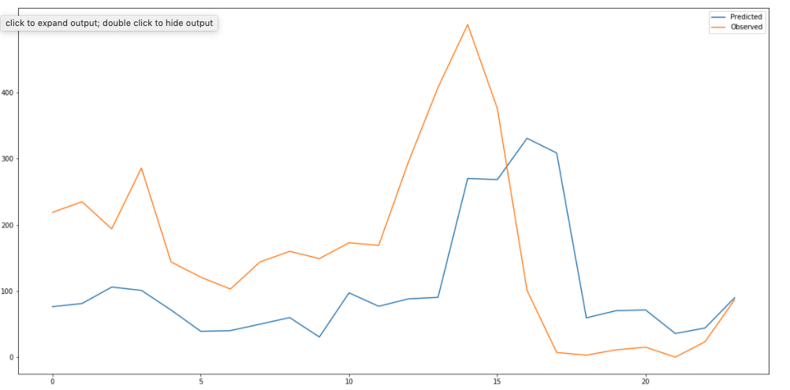

# MenViz: Analyzing and Forecasting Meningitis Outbreaks
The African meningitis belt is a group of 26 countries that is acutely susceptible to meninigitis outbreaks, which can spread out of control and has killed hundreds of thousands of people. We present a dataset with more than **16 years of information** from the [World Health Organization](https://www.who.int/emergencies/diseases/meningitis/epidemiological/en/) (more information about the dataset can be found below) as well as a **novel forecasting pipeline + symbolic natural language understanding framework** for extracting key details from text reports. 

### Results
Below are sample results for different countries. The y-axis represents the number of cases and the x-axis represents time where each datapoint is spaced one month apart - notice that the pipeline is robust to different patterns.



### Pipeline
The pipeline is divided into two stages
1. Symbolically extracting details for each country from WHO reports as shown below

2. Combine this information with the previous recorded number of cases (over several timesteps) to predict the number of cases at the next timestep. We define this formally here:

### Dataset Information
Note, the dataset which can be found  contains 5 columns: Date, Cases, Deaths, and Summary. The Current_Data folders contains several .csv files which are preprocessed version of the original dataset used for subsequent downstream tasks.
The dataset was collected from weekly/monthly reports published by the World Health Organization that can be found [here](https://www.who.int/emergencies/diseases/meningitis/epidemiological/en/). Each report contains two key bits of information:
1. A table with the number of recorded cases and deaths for each country across a specific timespan (in this case 1 week). We use this table to record individual rows in our dataset


2. A section titled comments containing specific insights for countries that mentions region-specific details. It may mention the attack rate (AR) of specific regions within a country that were particularly high for example


For each report, we fill rows in our dataset with the number of cases, deaths, and any relevant country-specific details from the comments in the Summary column. Note, for the date we follw this convention for consistency:
- If the report spans one week, we record the date as the first day in the range. For example, given January 3 - January 10, we would record January 3 as the date for the information from the table
- If the report spans greater than one week (usually around a month), we record the date as the midpoint of the range


### Code Information
There are 2 keys file in the Code folder:
1. data_preprocessing.ipynb
This iPython notebook contains code to preprocess the original dataset for subsequent downstream tasks. It standarizes country names (since the same countries are referred to with different names in the original WHO reports), generates thresholds, processes the data into a pandas df, and more.

2. Forecasting Pipeline.ipynb
This iPython notebook contains **all the code you need to run this pipeline**. It's composed of 3 modular classes which are combined in a final 4th class called ForecastingPipeline. To use this pipeline, it's as easy as doing the following
```
auto_arima = AutoArima()
auto_arima.fit(train_data)
pipeline.find_optimal_parameters()
pipeline.fit_and_predict(test_data, month_data_country_prophet, test_states, test_summaries, separation_test)
```
Note the parameters for auto_arima.fit and pipeline.fit_and_predict will be available by running the prepare_data_for_model function at the top - that is where you can specify the country_index or the country from which to use data for. Currently, the code is written to run for the 7 countries with the most complete data, however this can be easily adapted in the data_preprocessing iPython notebook.
